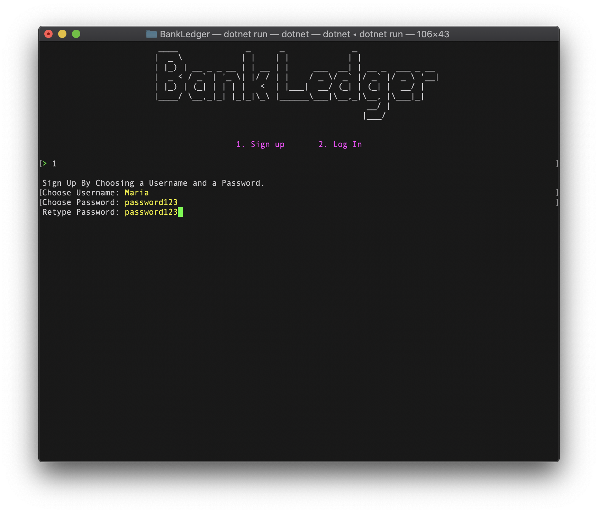
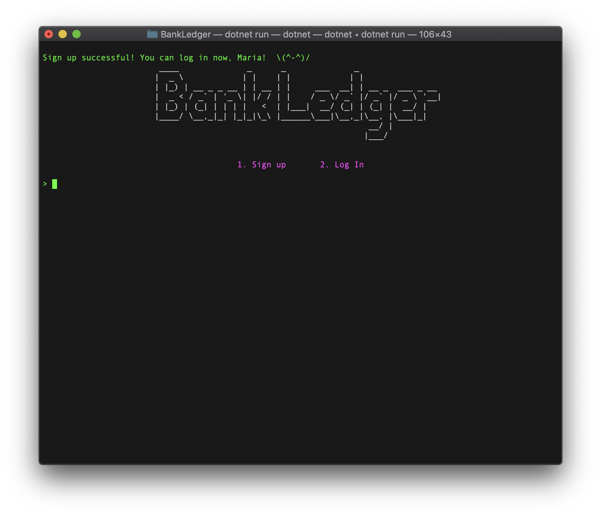
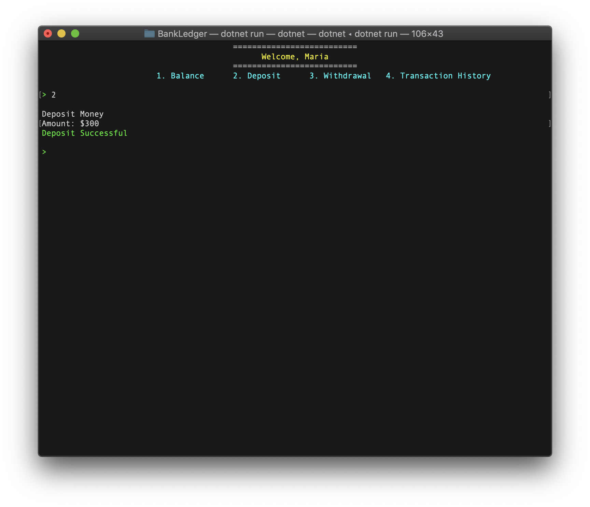
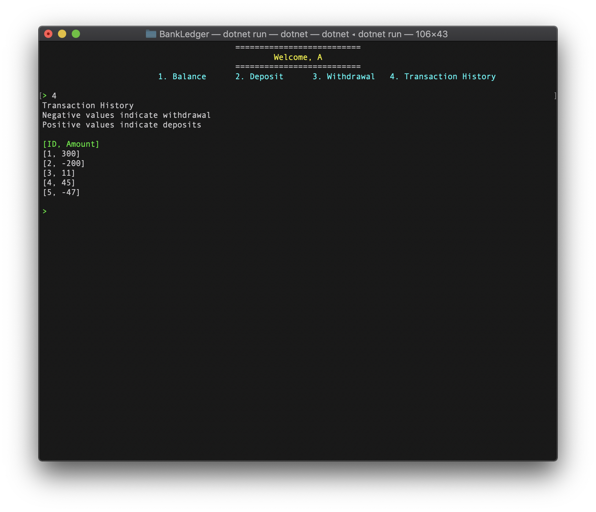

## Bank Ledger Console Application

Functions:
1. Check balance
2. Record a deposit
3. Record a withdrawal
4. Check transaction history
5. Log Out 
    1. Once logged in, type ``log`` to log out

### Database

The Database is in-memory, using Dictionaries as tables for the data. 
The username of each user is unique so it acts as the ID between the tables. 
1. There are 3 main datasets. 
    1. _user : Hold all the users in the application
    2. _userBalance : Holds the current balances of each user
    3. _transactionHistory : A Dictionary of inner dictionaries that use the username of a user as an ID and displays the transaction histories of each user. 

